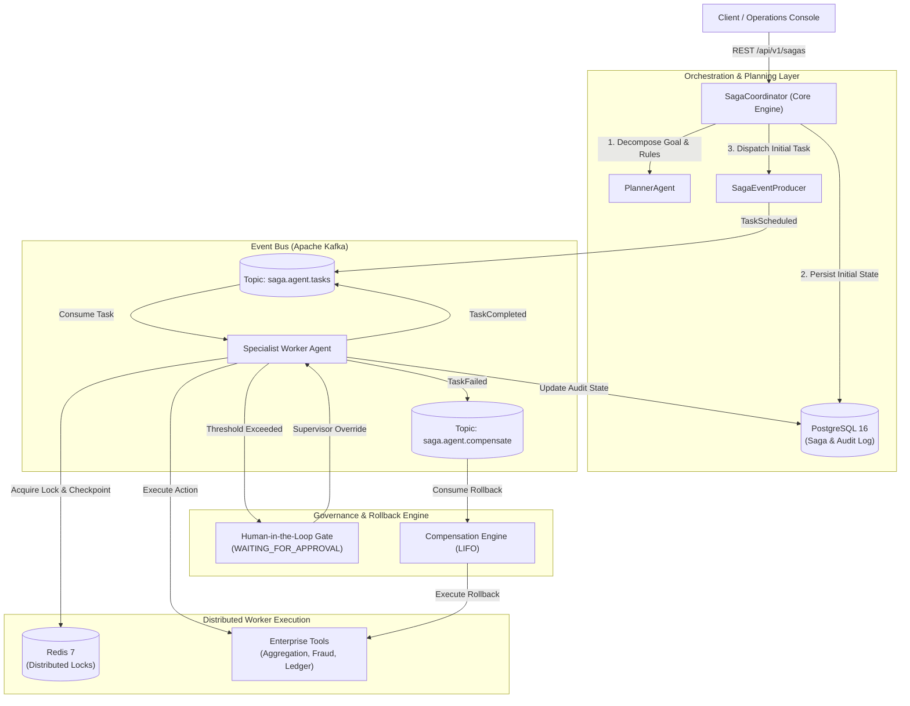
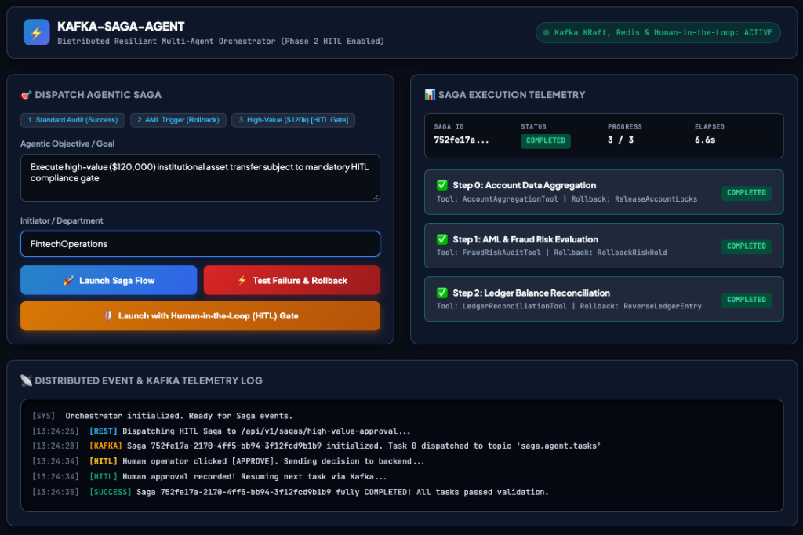

# Kafka-Saga-Agent

[](https://www.oracle.com/java/)
[](https://spring.io/projects/spring-boot)
[](https://kafka.apache.org/)
[](https://redis.io/)
[](https://www.postgresql.org/)
[](LICENSE)

> **Enterprise-Grade Distributed Multi-Agent Orchestration Platform**  
> Bringing resilient Event Sourcing, Distributed Checkpointing, and Human-in-the-Loop (HITL) Governance to Autonomous AI Agent Workflows.

---

## 🏛️ Executive Overview

Modern enterprise AI agents (e.g. built with Python-based frameworks like LangChain or CrewAI) face critical operational limitations when deployed to mission-critical banking and fintech workloads:

1. **Synchronous In-Memory Fragility:** Multi-step agent executions run in-memory within single container processes. A network timeout, pod eviction, or process crash permanently destroys intermediate reasoning context.
2. **The Dual-Write & Non-Idempotent Hazard:** If an agent performs an external mutation (e.g., reserving customer funds, updating a ledger balance) and subsequently times out before acknowledging, retrying the agent creates duplicate transactions.
3. **Absence of Reversal (Compensation) Protocols:** When downstream third-party APIs or validation checks fail irrevocably, traditional agents terminate with an unhandled exception, leaving upstream systems in a corrupted, inconsistent state.
4. **Compliance & Guardrail Gaps:** Regulatory frameworks (e.g., EU AI Act, SOC2) mandate deterministic authorization barriers before autonomous agents execute irreversible financial or high-risk operations.

### The Architecture: Distributed Saga Pattern for Agentic AI
**Kafka-Saga-Agent** re-engineers autonomous agent orchestration by applying the **Distributed Saga Pattern** across an event-driven architecture:
* **Event Sourced Execution:** Every agent plan, step delegation, and tool outcome is an immutable Kafka event.
* **Resilient Distributed Checkpointing:** Redis provides short-term distributed locks and sub-second state caching; PostgreSQL maintains an ACID-compliant, tamper-proof execution audit log.
* **Deterministic Reverse Compensations (LIFO):** If a downstream task fails, the engine automatically dispatches reverse compensating actions in Last-In-First-Out order, ensuring zero dangling transactions.
* **Human-in-the-Loop (HITL) Compliance Gate:** High-value transactions dynamically suspend autonomous execution and trigger real-time operator approval workflows.

---

## 📐 System Architecture



---

## ⚡ Core Capabilities

| Capability | Technical Mechanism | Enterprise Value |
| :--- | :--- | :--- |
| **Event-Driven Resilience** | Apache Kafka (KRaft mode) | Zero context loss. If a worker node crashes mid-step, rebalanced consumers pick up the exact partition and resume execution. |
| **Distributed Idempotency** | Redis Distributed Locks (`SETNX`) | Prevents duplicate tool execution during network retries or concurrent worker dispatch. |
| **Automated Compensations** | LIFO Rollback Engine | Reverses completed upstream mutations (e.g., releases account holds if AML check fails). |
| **Human-in-the-Loop (HITL)** | State Suspension (`WAITING_FOR_APPROVAL`) | High-value thresholds (> $100,000) or sanction alerts pause execution for compliance sign-off. |
| **Auditable State Log** | PostgreSQL Event Store | Full historical trace of inputs, outputs, timestamps, and operator actions for regulatory audits. |
| **Live Telemetry Dashboard** | Embedded Real-Time Web Console | Visual pipeline showing state transitions, active locks, and live streaming Kafka logs. |

---

## 🖥️ Live Operational Dashboard

The platform includes a built-in, low-latency visual operations console served directly by the Spring Boot container at:

👉 **`http://localhost:8080`**

<p align="center">
  
</p>

### Console Features:
* **Interactive Workflow Dispatcher:** Trigger Standard Audits, Simulated Failures, or High-Value HITL compliance flows with one click.
* **Live Pipeline Visualizer:** Interactive cards showing step progression:  
  `PENDING` ➔ `RUNNING` ➔ `COMPLETED` (or `WAITING_FOR_APPROVAL` ➔ `COMPENSATING` ➔ `COMPENSATED`).
* **Operator Decision Gate:** Integrated approval modal allowing compliance officers to **Approve & Resume** or **Reject & Rollback** suspended sagas.
* **Streaming Kafka Event Terminal:** Real-time log showing topic dispatches, partition consumption, and distributed lock lifecycles.

---

## 🚀 Quickstart & Deployment

### 1. Prerequisites
* **Docker & Docker Compose**
* **Java 17 or Java 21**
* **Maven 3.8+** (or IDE bundled Maven)

### 2. Infrastructure Setup (Docker)
Start Apache Kafka (KRaft), Redis, and PostgreSQL with a single command:

```bash
cd code/docker
docker compose up -d
```

Verify service health:
```bash
docker compose ps
```

| Service | Port | Description |
| :--- | :--- | :--- |
| **Apache Kafka (KRaft)** | `9092` | Event bus for agent task dispatching & compensation |
| **Redis** | `6379` | Distributed locks, state caching, and idempotency store |
| **PostgreSQL** | `5432` | Durable database for saga states & audit trails (`saga_db`) |

### 3. Build & Run Application
```bash
cd ../code
mvn clean spring-boot:run
```
*Or open the `code/` folder in IntelliJ IDEA and run `SagaAgentApplication`.*

---

## 📡 REST API Specifications

### 1. Dispatch Autonomous Workflow
Initiates a standard multi-agent execution pipeline.

```bash
POST /api/v1/sagas
Content-Type: application/json

{
  "goal": "Perform multi-account financial audit and transaction validation for client #CLI-98213",
  "initiator": "FintechOperations"
}
```

### 2. Dispatch High-Value Workflow (Human-in-the-Loop Gate)
Flags execution for mandatory compliance sign-off when high-risk thresholds are exceeded.

```bash
POST /api/v1/sagas/high-value-approval
Content-Type: application/json

{
  "goal": "Execute institutional fund transfer of $120,000 subject to AML review",
  "initiator": "WealthManagement"
}
```

### 3. Operator Human Decision (Approve or Reject)
Resumes execution or triggers automated reverse compensations.

```bash
# Approve & Resume Workflow
POST /api/v1/sagas/{sagaId}/approve
Content-Type: application/json

{
  "approvedBy": "SeniorComplianceOfficer",
  "notes": "Verified source of wealth documentation"
}

# Reject & Trigger LIFO Rollback
POST /api/v1/sagas/{sagaId}/reject
Content-Type: application/json

{
  "approvedBy": "SeniorComplianceOfficer",
  "notes": "Sanctions screening mismatch detected"
}
```

### 4. Query Saga Telemetry & Audit Trail
Fetches full execution state, step latencies, inputs, outputs, and compensation history.

```bash
GET /api/v1/sagas/{sagaId}
```

---

## 📁 Repository Structure

```text
kafka-saga-agent/
│
├── README.md                      # Architecture, technical overview & specifications
├── .gitignore                     # Production Git exclusion rules
│
├── web-app/                       # Standalone frontend operations console
│   └── index.html
│
└── code/                          # Spring Boot enterprise application
    ├── pom.xml                    # Maven dependency descriptor
    ├── docker/
    │   ├── docker-compose.yml     # Multi-container orchestration (Kafka, Redis, Postgres)
    │   └── postgres-init/init.sql # Database DDL & indexing
    │
    └── src/main/
        ├── resources/
        │   ├── application.yml    # Kafka, Redis, and JPA configuration
        │   └── static/index.html  # Embedded live operations dashboard
        └── java/com/enterprise/agent/saga/
            ├── SagaAgentApplication.java
            ├── config/            # KafkaTopicConfig, RedisConfig
            ├── domain/            # SagaInstance, SagaStep, SagaStatus, AgentTaskEvent
            ├── dto/               # SagaRequest, SagaResponse, ApprovalRequest
            ├── repository/        # SagaInstanceRepository, SagaStepRepository
            ├── tools/             # AgentTool, AccountAggregation, FraudRisk, LedgerRecon
            ├── orchestrator/      # PlannerAgent, SagaCoordinator, CompensationEngine
            ├── event/             # SagaEventProducer, SagaWorkerConsumer, SagaCompensationConsumer
            └── controller/        # REST API Controllers
```

---

## 🛡️ License

This project is licensed under the Apache License 2.0 - see the [LICENSE](LICENSE) file for details.
